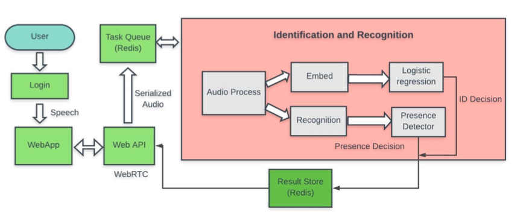
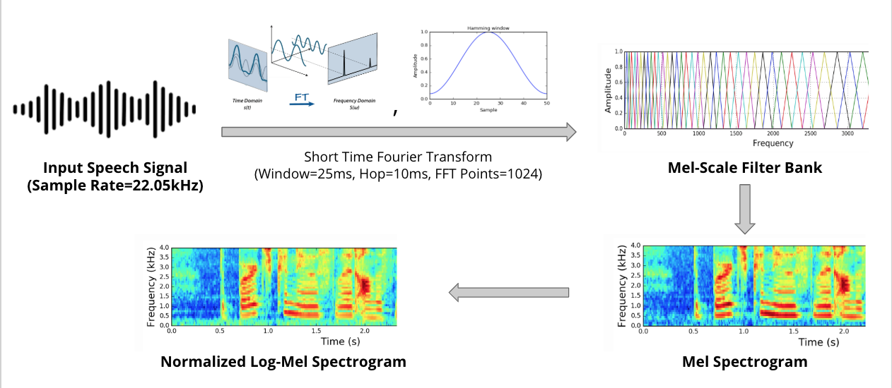
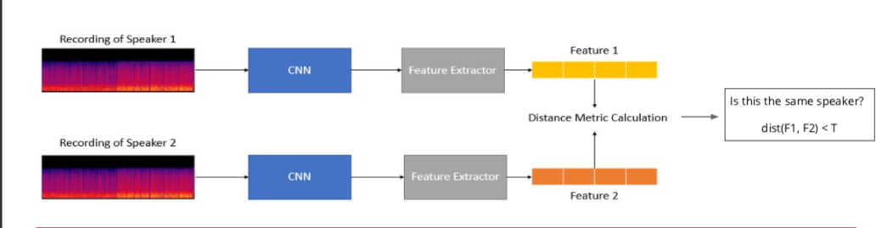
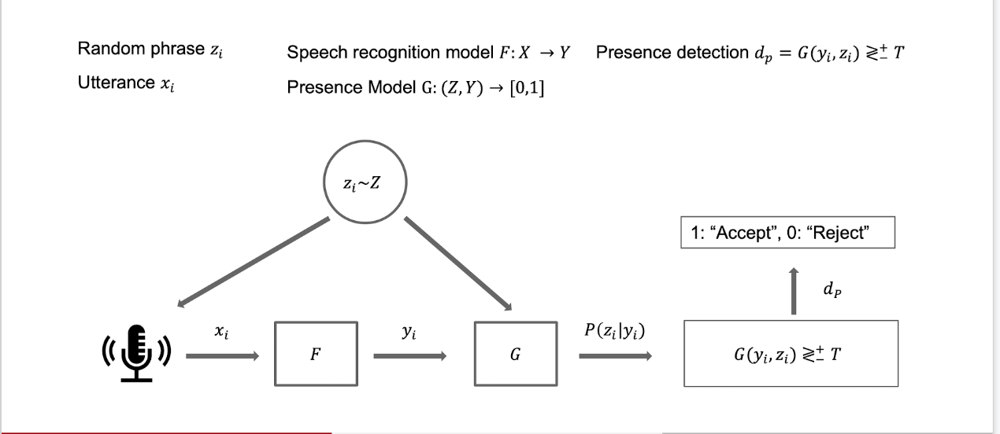
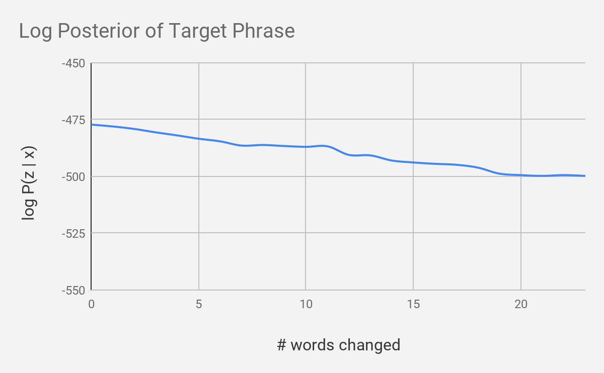

# You Only Listen Once

The YOLO system is a practical speech login system that securely authenticates users via a web application. The system scales to many users and requires few speech samples for registration and only one speech sample at login. To prevent an impersonation attack, an impostor detection model based on speech recognition is used. There are a number of pressing use cases for such technology, such as

1. Transaction Authentication
2. Password Reset via Voice
3. Voice Controlled Locks (eg. opening a door or unlocking a car)
4. Access Control for Computers
5. Information Retrieval

Our system is tested on held-out data to guarantee high precision during identification and presence detection in order to ensure security.

## System Diagram

## Speech Processing

## Speaker Verification

## Speaker Identification

## Presence Detection

ECE Capstone Project @ Carnegie Mellon

Authors: Ryan Brigden, Nikhil Rangarajan, and Richa Ravi
